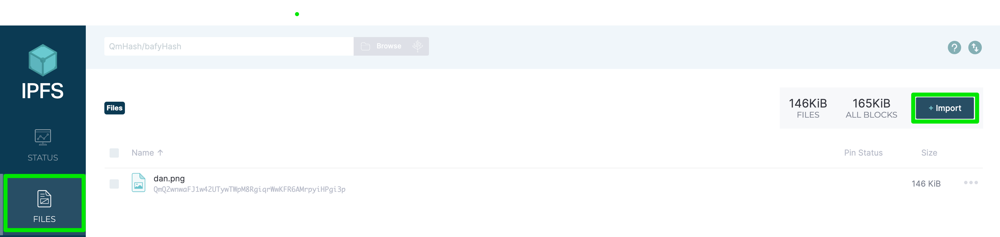
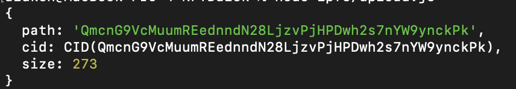

# Mint NFT 

How to Mint NFTs

### Step 1: Set Up Project Structure Using Hardhat
1. install npm libraries such as `hardhat` `dotenv` `ipfs-core` and `ipfs-http-client`
2. `npx hardhat init` and setup a basic hardhat project
3. `hardhat.config.js` file setup
```
require("@nomicfoundation/hardhat-toolbox");
require('dotenv').config();

/** @type import('hardhat/config').HardhatUserConfig */
module.exports = {
  solidity: "0.8.24",
  networks: {
    sepolia: {
      url: process.env.ALCHEMY_SEPOLIA_URL,
      accounts: [process.env.SEAN_PRIVATE_KEY],
    },
    mainnet: {
      url: process.env.ALCHEMY_MAINNET_URL,
      accounts: [process.env.SEAN_PRIVATE_KEY],
    },
    localhost: {
      url: "http://127.0.0.1:8545/"
    }
  }
};
```
4. set up `.env`
```
SEAN_PRIVATE_KEY=
ALCHEMY_API_KEY=
ALCHEMY_MAINNET_URL=
ALCHEMY_SEPOLIA_URL=
```

Project setup done! Let's customize it for our own NFT and our own friends now.

### Step 2: Storing Metadata
It's time to store metadata on IPFS!

1. First, install IPFS: https://ipfs.tech/#install (either the CLI or desktop app is fine, we recommend checking out the desktop app!)
2. Upload your image by clicking on "FILES" and then "+ Import":
IPFS Instructions

3. Click on the image and click "... More".
4. Click "Share link" to get a URL you can use to access your image on the web. Try it out, put the URL in your browser bar and search.
5. Click "Copy CID" to get the content identifier for your NFT image.

Next let's upload metadata! You'll create a JSON file representing the standard NFT metadata and store it on IPFS. Let's do this programmatically!

6. Open up the file ipfs/deploy.js, complete the TODOs to add your NFT image CID and add whichever attributes you desire!

Once you are happy with your final NFT metadata and image...

7. Run `node ipfs/upload.js`


8. You will see a new `CID` output on the terminal. This is the CID to your metadata! You will need it for the Step #4 when we mint your NFT. Copy this CID

Go to your IPFS client you should find your metadata listed on the FILES tab!
 
### Step 3: Create your NFT Contract
Now it's time to actually deploy our ERC-721 contract from which we will mint our NFTs to ourselves and our friends - the possibilities are endless!

1. Take a look at the `contracts/MyToken.sol` file.
2. Customize your NFT. You can rename the contract, token name and token symbol!

To deploy, run `npx hardhat ignition deploy ignition/modules/MyToken.js --network sepolia`
If that runs successfully, you will have minted yourself an NFT! Take a look on Sepolia Etherscan or OpenSea Testnet to see if you can find your NFT 😃

To interact and mint your NFT coin with the image, run `npx hardhat run scripts/interact.js --network sepolia`

Sometimes it can take a little while for IPFS to discover your metadata. You may need to tell OpenSea to refresh your metadata when it becomes available on the IPFS network. You can also try a pinning service like Pinata!